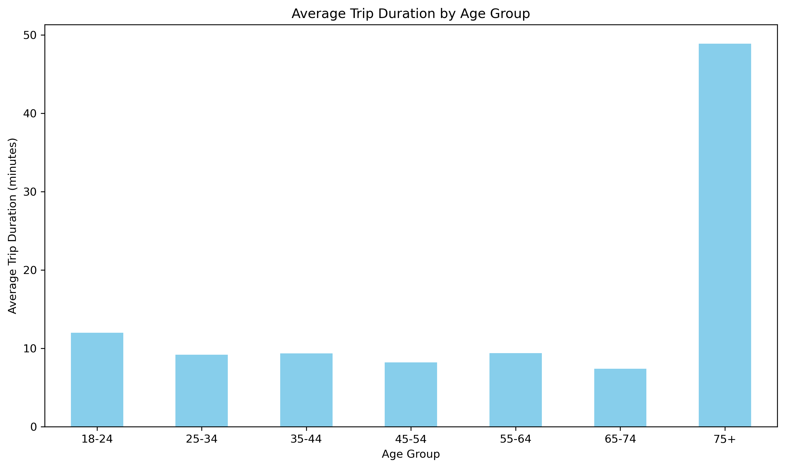
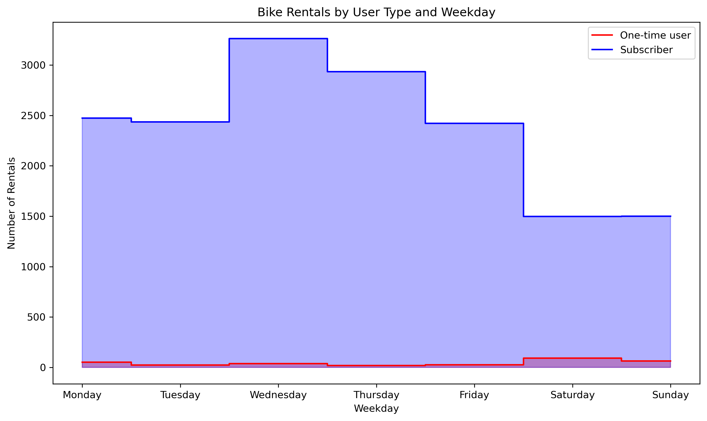

# 🚲 Citi Bike Usage Analysis – CareerFoundry Case Study

This data analysis project explores New York City’s Citi Bike usage using Python and pandas. It was developed as part of a CareerFoundry short course that initially relied on Google Sheets, with the goal of uncovering trends based on user type, age, trip duration, and weekday behavior.

---

## Visual Insights

### Most Popular Start Stations

> High-traffic start stations suggest central hubs or transit connections. This could inform rebalancing strategies.  
> The three most popular pick-up stations are **Grove St PATH**, **Exchange Place**, and **Sip Ave**.

---

### Number of Bikes Rented by Age Group

> The most active riders are aged **35–44**, likely regular commuters.  
> The **youngest (18–24)** and **oldest (75+)** groups rent the fewest bikes.

---

### Average Trip Duration by Age Group

> Riders over **75 years old** take the **longest trips on average**, suggesting recreational use.  
> Other age groups tend to have shorter, more consistent trip durations.

---

### User Type by Weekday

> There are significantly more **Subscribers** than **One-Time Users**.  
> **Subscriber usage peaks on weekdays**, confirming commuter behavior.  
> **One-Time Users peak on weekends**, likely tourists or casual riders.

---

### Trip Duration vs Temperature & Age

> There is no clear relationship between **temperature** and **trip duration**, or between a **user’s age** and **trip duration**.

---

## Recommended Actions

### Product Recommendations
- Install additional bikes at:
  - Grove St PATH
  - Exchange Place
  - Sip Ave

### Marketing Recommendations
- Focus on **Subscribers aged 35–44**, the most active group.
- Prioritize **weekday campaigns** targeting commuter segments.
- Consider **tourist-oriented offers** for weekends.

---

## 🧰 Tools Used

- Python (pandas, matplotlib)
- Google Sheets (initial exploration)
- Git & GitHub

---

## Steamlit App: 
https://transport-emissions-diet-calculator.streamlit.app/
